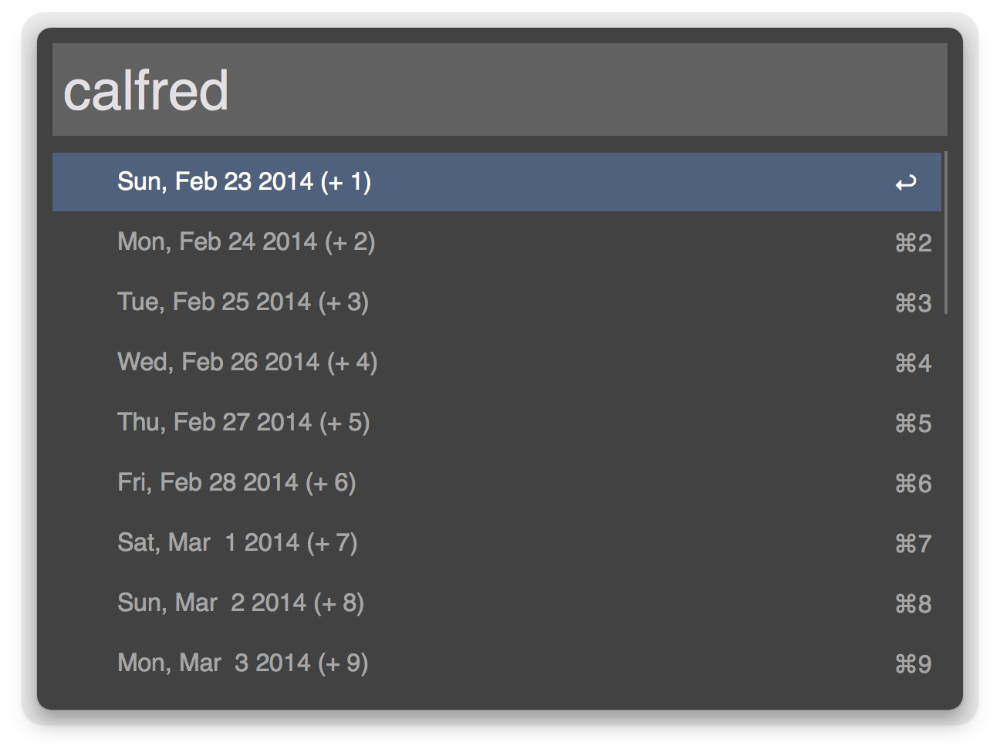
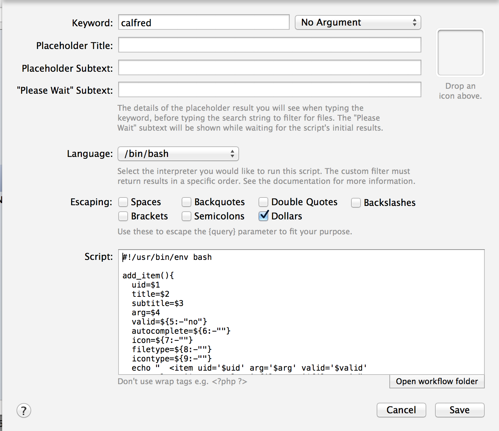

# Calfred

Display the upcoming Calendar days in the Alfred results pane. Uses [alfred-feedback-xml-generation](https://github.com/lrrfantasy/alfred-feedback-xml-generation) by @lrrfantasy.

It doesn't seem to matter what settings you select, but here are mine:

[Download Calfred here](Calfred.alfredworkflow)
